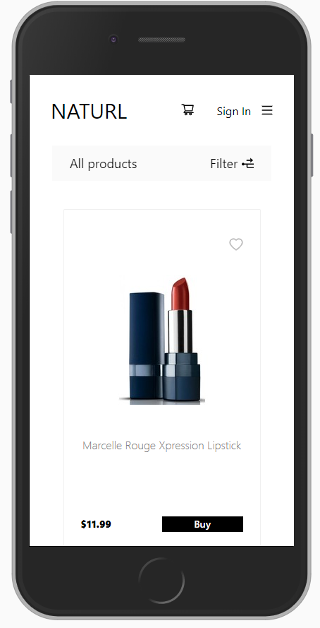

# NATURL

An online e-commerce boilerplate store based on the JAM stack. The SPA app provides all the functionality necessary for a merchant to display their merchandise to customers, build a customer database, and collect a payment within hours. 

## Deployed Site

Visit the live demo store at https://naturl.netlify.app/
We recommend signing in for full experience. Guest credentials found below: 

    Guest credentials: guest@guest.com 123456

## Screenshots

  

## Getting started

* To run the project you will need git, Node and npm installed
* Create a Stripe Account as you will need your own set of keys.
* Create a Firebase Account as you will need your own set of keys.

## Installation

1. Clone the repository.
2. Run `npm install` in the client root folder.
3. Create an .env file in your client root folder. (Instructions below)
4. Run `npm start` in your client root folder.

## Environment Variables

Create a .env file in the **client** folder with the following variables: 

    SKIP_PREFLIGHT_CHECK=true
    REACT_APP_FIREBASE_KEY=YOUR_FIREBASE_KEY
    REACT_APP_FIREBASE_DOMAIN=YOUR_FIREBASE_DOMAIN
    REACT_APP_FIREBASE_DATABASE=YOUR_FIREBASE_DATABASE
    REACT_APP_FIREBASE_PROJECT_ID=YOUR_FIREBASE_PROJECT_ID
    REACT_APP_FIREBASE_STORAGE_BUCKET=YOUR_FIREBASE_STORAGE_BUCKET
    REACT_APP_FIREBASE_SENDER_ID=YOUR_FIREBASE_SENDER_ID
    REACT_APP_STRIPE_CHECKOUT_PK=YOUR_STRIPE_PK
    REACT_APP_STRIPE_CHECKOUT_SK=YOUR_STRIPE_SK
    REACT_APP_DOMAIN=YOUR_APP_DOMAIN

For local development REACT_APP_DOMAIN would be http://localhost:3000 (replace port 3000 if using a different port).

## Built with

* [React](https://reactjs.org/) - Front end library for building user interfaces

* [Reach Router](https://reach.tech/router/) - Next Generation Routing for React

* [Stripe API](https://stripe.com/docs/api) - An API service that allows users to accept payments online. 

* [Firebase](https://facebook.github.io/react-native) - A web application development platform  used for realtime database and authentication.

* [Sass](https://sass-lang.com/) - A powerful CSS extension language..

* [Ant D](https://ant.design/) - A design system for enterprise level products.

## Developers

* Sofiya Lazarova - [GitHub](https://github.com/) - [LinkedIn](https://www.linkedin.com/)
* Jorge de La Fuente - [GitHub](https://github.com/jorgedelafuente) - [LinkedIn](https://www.linkedin.com/in/jorgedelafuente/)
* Juan Carrillo - [GitHub](https://github.com/) - [LinkedIn](https://www.linkedin.com/)
* Chris Akua - [GitHub](https://github.com/) - [LinkedIn](https://www.linkedin.com/)